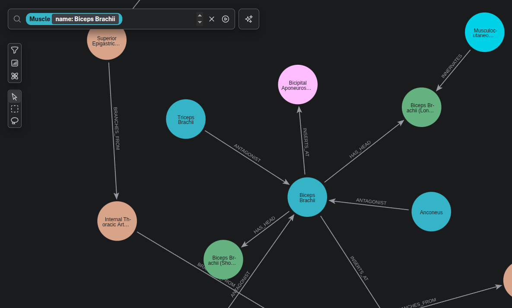
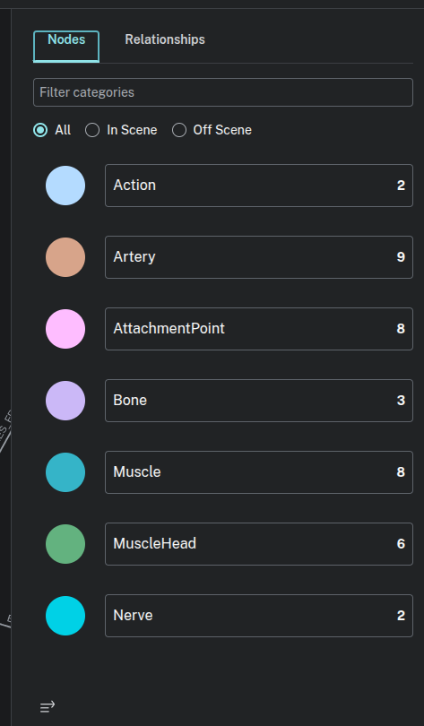
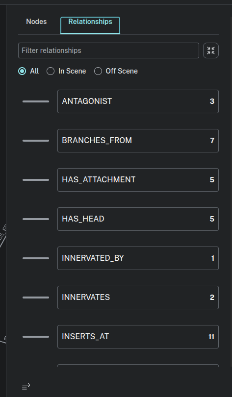
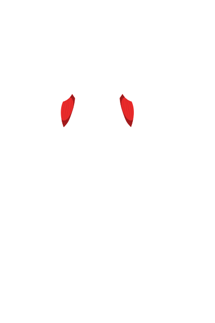
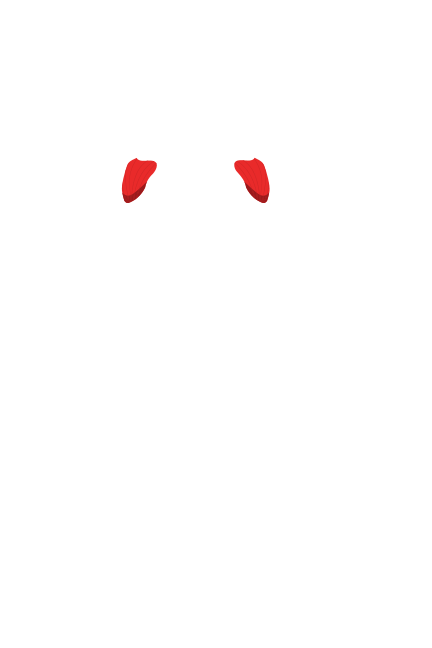

# Stronger Anatomy Domain GraphDB

Canonical anatomy domain dataset and graph builder for Stronger.

This repository provides:

- structured YAML anatomy data (`config/<category>/<muscle_group>`)
- a Python package (`stronger_anatomy`) for loading/typing that data
- a CLI (`stronger-anatomy`) for validation, CSV export, and direct Neo4j ingestion
- normalized SVG references (`svgs/manifest.json`) keyed by anatomy IDs
- packaged cleaned overlay SVGs + manifest (`stronger_anatomy/assets/overlay_manifest.json`) for API/frontend consumption

## Package usage in other repos

### Install from git

```bash
pip install "git+https://github.com/<org>/stronger-domain-graphdb.git"
```

### Import and load a region

```python
from stronger_anatomy.databases.anatomy.loader import AnatomyLoader
from stronger_anatomy.domain import build_anatomy_model

loader = AnatomyLoader()
region = loader.load_region("chest")
model = build_anatomy_model(region)
print(model.region, len(model.muscles))
```

## Local development

```bash
poetry install
```

### Discover available regions

```bash
poetry run stronger-anatomy --list-regions
```

### Validate anatomy references

```bash
poetry run stronger-anatomy --region chest --validate-only
poetry run stronger-anatomy --region all --validate-only
```

### Export Neo4j CSV artifacts

```bash
poetry run stronger-anatomy \
  --region chest \
  --output data/neo4j \
  --validate
```

### Ingest directly into Neo4j via Bolt

The CLI reads `.env` at repo root when present.

```dotenv
NEO4J_URI=bolt://localhost:7687
NEO4J_USERNAME=neo4j
NEO4J_PASSWORD=password
NEO4J_DATABASE=neo4j
```

```bash
poetry run stronger-anatomy \
  --region all \
  --mode bolt \
  --wipe-database \
  --validate
```

### Neo4j free tier (AuraDB)

If you do not want to run Neo4j locally, you can use Neo4j AuraDB Free.

- Product page: https://neo4j.com/cloud/aura/
- Aura console: https://console.neo4j.io/
- Aura docs: https://neo4j.com/docs/aura/

After creating an Aura Free instance, copy connection details into `.env`:

```dotenv
NEO4J_URI=neo4j+s://<instance-id>.databases.neo4j.io
NEO4J_USERNAME=neo4j
NEO4J_PASSWORD=<your-password>
NEO4J_DATABASE=neo4j
```

Then run the same ingestion command:

```bash
poetry run stronger-anatomy --region all --mode bolt --validate
```

### Make target

```bash
make neo4j-refresh REGION=all
```

This target runs the CLI in bolt mode with validation and optional wipe.

## Screenshots

Example query (biceps and connected structures):



Available node labels:



Available relationship types:



## SVG assets

- Raw source SVGs: `svgs/svg_front_muscles`, `svgs/svg_rear_muscles`
- Normalized output: `svgs/muscles/<muscle_id>/<view>.svg`
- Manifest: `svgs/manifest.json`
- Packaged overlay manifest: `stronger_anatomy/assets/overlay_manifest.json`
- Packaged overlay SVGs: `stronger_anatomy/assets/anatomy/*.svg`

Regenerate normalized SVGs:

```bash
poetry run python scripts/normalise_svgs.py
```

### SVG previews

Biceps brachii (front):



Deltoid (front/rear):



## Tests and CI

```bash
poetry run pytest
```

GitHub Actions CI runs tests on push and pull requests.

## Publishing notes

- License: MIT (`LICENSE`)
- Keep `.env`, `data/`, `neo4j-data/`, and `neo4j-logs/` out of git
- Verify rights for any third-party SVG assets before public release
- Contribution guide: `CONTRIBUTING.md`
- Security policy: `SECURITY.md`
